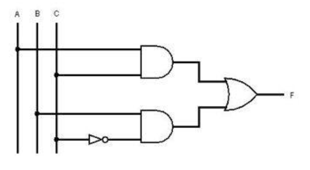

# ***Objective:***

* To understand the working principles of NAND and NOR gates  
* To construct AND, OR, NOT, XOR, and XNOR gates using only universal gates (NAND and NOR)  
* To analyze the efficiency of logic circuits by comparing the gate count and complexity when implementing basic gates using universal gates.

# ***Theory:***

* ### Universal Gates

Universal gates are a type of logic gate that can be used to implement any Boolean function without using any other type of gate. NAND and NOR gates are the two universal gates, and they have the ability to create all other basic logic gates such as AND, OR, NOT, XOR, and XNOR.

##### NAND Gate as a Universal Gate

The NAND gate is a combination of an AND gate followed by a NOT gate. It outputs true only when not all of its inputs are true. The significance of the NAND gate being universal is that it can be used to create any other basic gate. For example:

* **NOT gate using NAND:** A single NAND gate can function as a NOT gate when both inputs are the same.  
* **AND gate using NAND:** A series of a NAND gate and a NOT gate implemented by another NAND gate can implement the AND operation.  
* **OR gate using NAND:** OR gates can be constructed using three NAND gates by applying De Morgan’s theorem.

##### NOR Gate as a Universal Gate

The NOR gate is a combination of an OR gate followed by a NOT gate. It outputs true only when all inputs are false. The NOR gate can also be used to create other basic gates:

* **NOT gate using NOR:** A single NOR gate functions as a NOT gate when both inputs are the same.  
* **AND gate using NOR:** AND gates can be built from three NOR gates using De Morgan’s theorem.  
* **OR gate using NOR:**  A series of a NOR gate and a NOT gate implemented by another NOR gate can implement the AND operation.

#### 

* ### Construction of Basic Gates

The main advantage of using universal gates is to minimize the number of different gate types in a circuit. In the lab, the following gates were implemented using either NAND or NOR gates:

* **AND gate using NAND/NOR gates:** This gate outputs true only when all inputs are true.  
* **OR gate using NAND/NOR gates:** This gate outputs true when at least one of the inputs is true.  
* **NOT gate using NAND/NOR gates:** The NOT gate inverts the input, outputting true when the input is false and vice versa.  
* **XOR gate using NAND/NOR gates:** The XOR gate outputs true when an odd number of inputs are true.  
* **XNOR gate using NAND/NOR gates:** The XNOR gate outputs true when an even number of inputs are true.

### 

* ### Boolean Algebra and De Morgan's Theorems

The theoretical foundation of the lab rests on Boolean algebra, which allows us to simplify and manipulate logic expressions. De Morgan’s theorems are particularly important for understanding how to implement logic gates using NAND and NOR gates. These theorems state that:

* **(A . B)’ \= A’ \+ B’**  
* **(A \+ B)’ \= A’ . B’**

These principles guide the process of converting AND, OR, and NOT gates into equivalent expressions using only NAND or NOR gates.

# ***Apparatus List:***

| No. | Component | Qty |
| :---- | :---- | :---- |
| **1** | IC 7400 Quadruple 2-input NAND gates | 2 |
| **2** | IC 7402 Quadruple 2-input NOR gates | 2 |
| **3** | Trainer Board | 1 |
| **4** | Jumper wire | 15 |

 Table 1: Apparatus List

# ***Circuit Diagrams:***

# ***Data Tables:***

| A | B | XOR(((A.B)’.(A.A)’)’.((A.B)’.(B.B)’)’)’ | XNOR ((((A.B)’.(A.A)’)’.((A.B)’.(B.B)’)’)’ . (((A.B)’.(A.A)’)’.((A.B)’.(B.B)’)’)’)’ |
| ----- | ----- | ----- | ----- |
| 0 | 0 | 0 | 1 |
| 0 | 1 | 1 | 0 |
| 1 | 0 | 1 | 0 |
| 1 | 1 | 0 | 1 |

 Table 2: Implementation of XOR and XNOR using NAND gates

| A | B | NOT Gate (A+A)’ | OR Gate ((A+A)’ \+ (B+B)’)’ | AND Gate((A+A)’+(B+B)’)’ | XOR ((((A+B)’+(A+A)’)’+((A+B)’+(B+B)’)’)’ \+ (((A+B)’+(A+A)’)’+((A+B)’+(B+B)’)’)’)’ | XNOR(((A+B)’+(A+A)’)’+((A+B)’+(B+B)’)’)’ |
| ----- | ----- | ----- | ----- | ----- | ----- | ----- |
| 0 | 0 | 1 | 0 | 0 | 0 | 1 |
| 0 | 1 | 1 | 1 | 0 | 1 | 0 |
| 1 | 0 | 0 | 1 | 0 | 1 | 0 |
| 1 | 1 | 0 | 1 | 1 | 0 | 1 |

 Table 3: Implementation of NOT, AND, OR, XOR and XNOR using NOR gates

| A | B | C | I1 \= A . C | I2 \= B . C’ | F \= I1 \+ I2 |
| :---- | :---- | :---- | :---- | :---- | :---- |
| 0 | 0 | 0 | 0 | 0 | 0 |
| 0 | 0 | 1 | 0 | 0 | 0 |
| 0 | 1 | 0 | 0 | 1 | 1 |
| 0 | 1 | 1 | 0 | 0 | 0 |
| 1 | 0 | 0 | 0 | 0 | 0 |
| 1 | 0 | 1 | 1 | 0 | 1 |
| 1 | 1 | 0 | 0 | 1 | 1 |
| 1 | 1 | 1 | 1 | 0 | 1 |

 Table 4: Truth table of combinational circuit in Figure (INSERT FIGURE NUMBER HERE)

# ***Report:***

### Q1.  
  
Figure B2
### Convert the combinational circuit of Figure B2 to a universal gate circuit using NOR gates only and simulate it using Logisim. You will need to convert the circuit to 2nd Canonical form and then minimize it before performing this conversion. Provide the Logisim circuit schematic with your report.

Answer:

From the truth table,   
(A+B+C) . (A \+ B \+ C’) . (A \+ B’ \+ C’) . (A’ \+ B \+ C) 

\= (A \+ B) . (A \+ B’ \+ C’ ) . (B \+ C)

\= (B \+AC) . (A \+ B’ \+ C’ ) 

\= AC \+ AB \+ BC’

\= AC \+ BC’ \[Consensus\]

\= (AC)’' \+ (BC’)’’

\=  (A’+C’)’ \+ (B’+C)’

# ***Discussion:***

#### 1\. Understanding Universal Gates

We have learned how to implement basic gates using the universal gates, NAND and NOR, thus proving their role as universal gates. This simplifies circuit design by reducing the number of gate types required. 

#### 2\. Gate Implementation Using NAND and NOR

The successful implementation of AND, OR, and NOT gates using both NAND and NOR gates relied heavily on Boolean algebra and De Morgan’s theorems. For instance, to create an OR gate using NAND gates, or to create an AND gate using NOR gates, we applied De Morgan’s law, which allowed us to convert the OR function into a combination of NAND gates. The construction of more complex gates, such as XOR and XNOR, required a combination of basic gates built from universal gates.

#### 3\. Efficiency and Optimization

The experiment also provided insight into the efficiency of logic circuits. Although NAND and NOR gates can be used to implement any logic function, doing so may require more gates than using the corresponding basic gates directly. For instance, constructing an XOR gate from NAND gates required more components and a more complex circuit than using a standard XOR gate. This balance between universality and efficiency is an important digital circuit design. While using universal gates simplifies design from a manufacturing perspective, it can also lead to increased gate counts.

#### 4\. Importance of De Morgan’s Theorems

The lab reinforced the importance of De Morgan’s theorems in digital logic design. These theorems provided a framework for converting between different logic gate configurations, especially when implementing OR and AND gates using NAND or NOR gates. The application of these theorems allowed us to simplify the design process and achieve the desired functionality using only universal gates.

#### 5\. Practical Applications

In practical applications, the ability to design circuits using only NAND or NOR gates is essential for optimizing cost and performance, as well as simplifying manufacturing processes. Integrated circuits often rely on universal gates to streamline production and reduce complexity. 

#### Precautions

- Check for faulty wires before the experiment to ensure proper connection  
- Use an IC Remover so that the IC pins don’t become damaged.  
-  Ensure proper connection of input and output pins: Always apply input voltages only to designated input pins and measure/output signals only from designated output pins. Incorrect connections may damage the circuit components or produce erroneous results.

# ***Simulation**:*

Simulation for the Boolean Expression F \= (A’ \+ C’)’ \+ (B’ \+ C)’  

